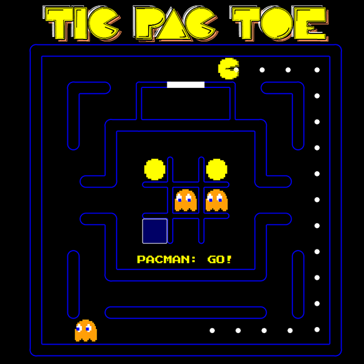

# Week 11 Coding Assignment - Tic-Tac-Toe

## Project Overview

This project is part of the Week 11 coding assignment for the Promineo Tech Front End Bootcamp course. The goal of this assignment was to apply the concepts learned throughout the week by building a functional JavaScript application that allows the user to play a game of tic-tac-toe.

## Features

- **Feature 1**: This week's project focused on building a functional JavaScript application that allows the user to play a game of tic-tac-toe. The game was built using HTML, CSS, and JavaScript. The user should be able to click on the squares to make a move, and the game should display the winner or a draw when the game is over.
- **Feature 2**: JQuery was a focus of this week's curriculum and was used throughout the project for DOM manipulation and event handling, albeit not exclusively.
- **Feature 3**: I decided to model the game after the classic Pacman video game. The game board is a 3x3 grid, and Player 1 is represented by a Pacman icon, while Player 2 is represented by a ghost icon. The game board is styled to resemble the classic Pacman game, with a black background and white grid lines. The game also includes sound effects for each move and a victory sound when a player wins the game.
- **Feature 4**: The animations throughout the game were implemented using CSS animations and transitions. The Audio was implemented using the HTML Audio element and JavaScript.

## Screenshots

Here are some screenshots of the application:


_Game start screen_


_Game in progress_


_Game over screen_

## Installation

To install and run this project locally, follow these steps:

1. Clone the repository:
   ```bash
   git clone https://github.com/yourusername/week11-coding-assignment.git
   ```
2. Navigate to the project directory:
   ```bash
   cd week11-coding-assignment
   ```
3. Install dependencies:
   ```bash
   npm install
   ```

## Usage

To start the application, run:

```bash
npm start
```

## Contributing

If you would like to contribute to this project, please follow these steps:

1. Fork the repository.
2. Create a new branch (`git checkout -b feature-branch`).
3. Make your changes.
4. Commit your changes (`git commit -m 'Add some feature'`).
5. Push to the branch (`git push origin feature-branch`).
6. Open a pull request.

## License

This project is licensed under the MIT License.

## Contact

For any questions or feedback, please contact patrick.murrayjr@gmail.com.
